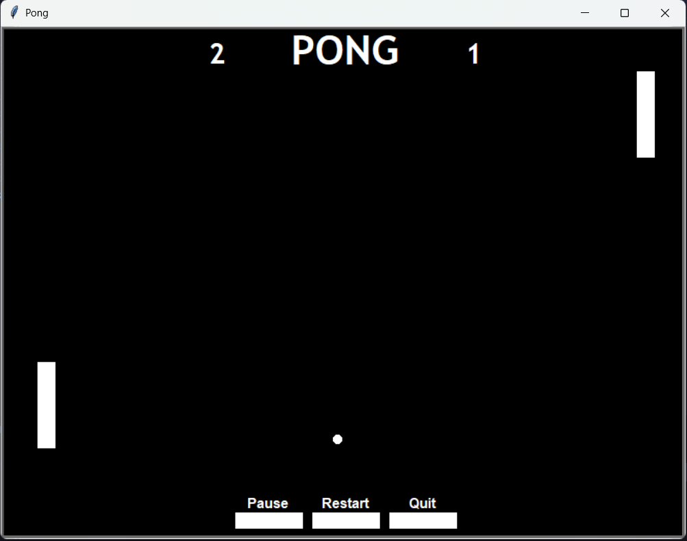

Pong Game (Python Turtle)

A fully interactive recreation of the classic Pong game, built using Python’s Turtle graphics module.
This project demonstrates game loop design, event-driven programming, object-oriented architecture, and basic UI systems.

Features

- Two-player gameplay

- Pause / Resume toggle

- Restart functionality

- Quit button

- State-based game control system

- Clickable UI dashboard (buttons)

- Real-time score tracking

- Dynamic ball speed (increases on paddle hit)

Project Structure

    Files       |             Role
    ------------+----------------------------------------
    main.py     |   # Game loop and control logic
    ball.py     |   # Ball physics and movement
    paddle.py   |   # Paddle movement and input handling
    score.py    |   # Score tracking and display
    menu.py     |   # UI buttons and dashboard

Concepts Implemented

1. Game Loop Architecture

The game runs on a continuous loop:

Updates screen

Processes movement

Handles collisions

Manages scoring

while game_on:
    update_screen()
    process_game_logic()

2. State Management System

The game uses a state variable to control behavior:

"running" → Game updates normally

"paused" → Game freezes but UI remains active

This ensures smooth pause/resume functionality without breaking the loop.

3. Event-Driven Input System

Instead of directly moving paddles on key press, the game uses state-based input tracking:

self.keys = {'Up': False, 'Down': False}

This allows:

Smooth continuous movement

Better control handling (like real games)

4. Object-Oriented Design

Each component is modular and independent:

Ball → Movement + physics

Paddle → Player control

Scoreboard → UI rendering

Menu / Button → Interactive controls

This makes the code:

Scalable

Maintainable

Easy to extend

5. Collision Detection

The game uses distance-based logic:

abs(ball.xcor() - paddle.xcor()) < threshold

Handles:

Paddle collisions

Wall bouncing

Goal detection

6. Dynamic Difficulty

Ball speed increases after each paddle hit:

self.fast *= 0.9

This introduces:

Progressive difficulty

Better gameplay experience

7. UI System (Custom Buttons)

A simple UI system is built using Turtle:

Buttons are clickable objects

Text is dynamically updated (e.g., Pause → Resume)

Dashboard positioned at bottom of screen

Controls

    Action	           |  Key
    -------------------+----- 
    Left Paddle Up     |   W	     
    Left Paddle Down   |   S
    Right Paddle Up	   |   ↑
    Right Paddle Down  |   ↓

Mouse:

Click buttons to Pause / Restart / Quit

How to Run

Clone the repository:

git clone https://github.com/YOUR_USERNAME/pong-game.git

Navigate into the folder:

cd pong-game

Run the game:

python main.py

Preview

Technologies Used

Python

Turtle Graphics

Through this project, I explored:

Game loop design

State machines

Event-driven programming

Object-oriented design in Python

Basic UI systems without external libraries (as turtle is a built-in library)

Author

Shroojan Dhok

If you like this project

Give it a ⭐ on GitHub!
